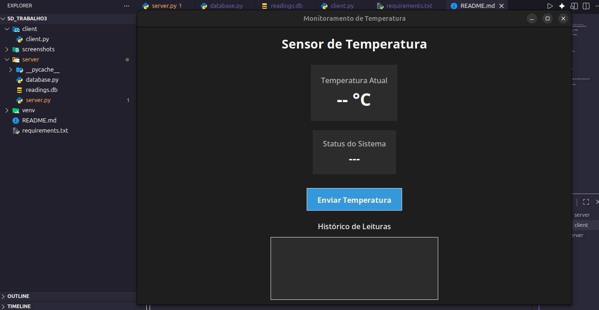
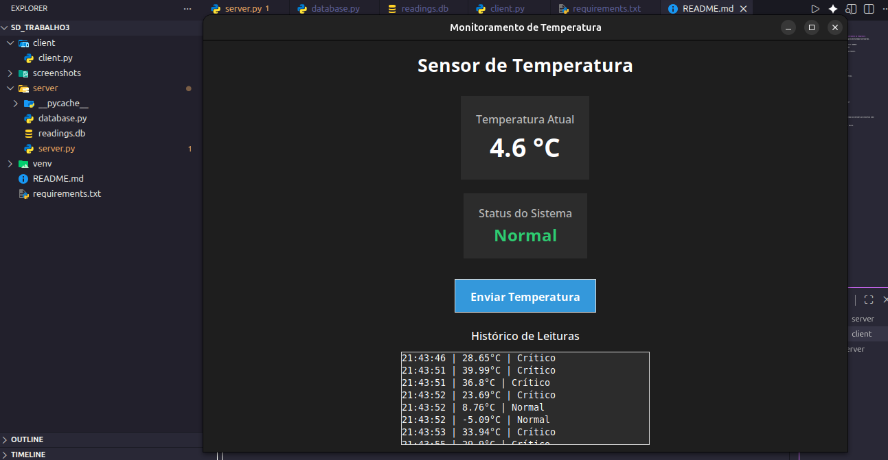

# Sistema Cliente/Servidor de Monitoramento de Temperatura

Projeto desenvolvido para a disciplina de Sistemas Distribuídos.

## Arquitetura

O sistema utiliza arquitetura em três camadas:

Cliente → Servidor → Banco de Dados

### Cliente
Simulador de sensor desenvolvido em Tkinter.

Funções:
- Gerar temperatura aleatória
- Enviar dados via HTTP
- Mostrar status retornado
- Mostrar histórico de leituras

### Servidor
API REST desenvolvida em Flask.

Funções:
- Receber dados do sensor
- Aplicar regras de negócio
- Verificar idempotência via UUID
- Persistir dados no banco

### Banco de Dados
SQLite para armazenamento das leituras.

Campos:
- id
- sensor_id
- temperatura
- status_logico
- timestamp

## Tecnologias

- Python 3
- Flask
- Tkinter
- SQLite
- Docker

## Execução
Preparar a Interface Gráfica (Linux/Ubuntu)

Antes de iniciar, permita que o Docker acesse o seu servidor X11 para exibir a janela do sensor:

    xhost +local:docker

2. Subir a Infraestrutura completa
Na raiz do projeto, execute:

    docker compose up --build

Este comando irá:

    Criar a rede interna rede_trabalho.

    Construir as imagens do Servidor e do Cliente.

    Sincronizar o horário dos containers com o fuso America/Sao_Paulo.

    Mapear o volume para que o banco leituras.db seja persistido na pasta /server.

    Abrir a interface gráfica do sensor automaticamente.

## Comandos Úteis

Parar tudo: Ctrl + C no terminal ou docker compose down.

Rodar em segundo plano: docker compose up -d.

Ver logs do servidor: docker logs -f servidor_api.

## Demonstração

### Interface do Cliente

O cliente envia temperaturas simuladas ao servidor que classifica como:

- Normal
- Alerta
- Crítico

### Dashboard do Sistema

Os dados são armazenados no banco SQLite.

### Banco de Dados SQLite

criação de uma Rede Docker
	docker network create rede_trabalho
	
	
dockerfile no server/ :
	FROM python:3.9-slim
	WORKDIR /app
	COPY requirements.txt .
	RUN pip install -r requirements.txt
	COPY . .
	# O servidor Flask precisa ouvir em todas as interfaces (0.0.0.0)
	CMD ["python", "server.py"]
	
dockerfile no cliente/:
	FROM python:3.9-slim
	RUN apt-get update && apt-get install -y python3-tk
	WORKDIR /app
	COPY requirements.txt .
	RUN pip install -r requirements.txt
	COPY . .
	CMD ["python", "client.py"]
	
	
	
seu código client.py:

	Antigo: http://localhost:5000/leitura
	Novo: http://servidor_api:5000/leitura (Usaremos o nome do container como endereço de rede).
	
	
	
Passo A: Subir o Servidor (Computador 1):
	docker build -t imagem_servidor ./server
	docker run -d --name servidor_api \
		  --network rede_trabalho \
		  -e TZ=America/Sao_Paulo \
		  -v $(pwd)/server/leituras.db:/app/leituras.db \
		  imagem_servidor
		  
		  
Passo B: Subir o Cliente (Computador 2):
	docker build -t imagem_cliente ./client
	xhost +local:docker # Permite que o container use seu monitor
	docker run -it --name cliente_sensor --network rede_trabalho \
	   -e DISPLAY=$DISPLAY -v /tmp/.X11-unix:/tmp/.X11-unix \
	   imagem_cliente
	   
	   
