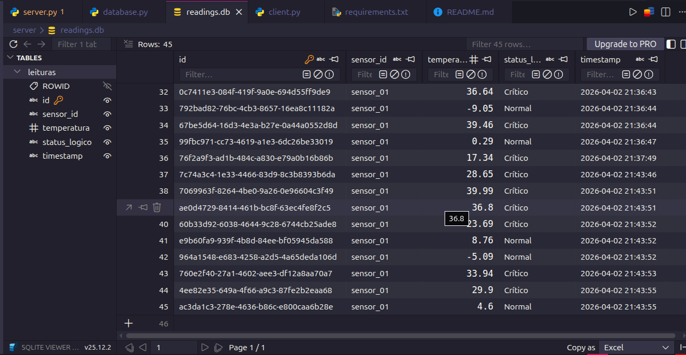

# Sistema Cliente/Servidor de Monitoramento de Temperatura

Projeto desenvolvido para a disciplina de Sistemas Distribuídos.

## Arquitetura

O sistema utiliza arquitetura em três camadas:

Cliente → Servidor → Banco de Dados

### Cliente
Simulador de sensor desenvolvido em Tkinter.

Funções:
- Gerar temperatura aleatória
- Enviar dados via HTTP
- Mostrar status retornado
- Mostrar histórico de leituras

### Servidor
API REST desenvolvida em Flask.

Funções:
- Receber dados do sensor
- Aplicar regras de negócio
- Verificar idempotência via UUID
- Persistir dados no banco

### Banco de Dados
SQLite para armazenamento das leituras.

Campos:
- id
- sensor_id
- temperatura
- status_logico
- timestamp

## Tecnologias

- Python 3
- Flask
- Tkinter
- SQLite

## Execução

Instalar dependências:
    pip install -r requirements.txt

Rodar servidor:
    python server/server.py

Rodar cliente:
    python client/client.py

## Demonstração

### Interface do Cliente

O cliente envia temperaturas simuladas ao servidor que classifica como:

- Normal
- Alerta
- Crítico

### Dashboard do Sistema

Os dados são armazenados no banco SQLite.

### Banco de Dados SQLite

